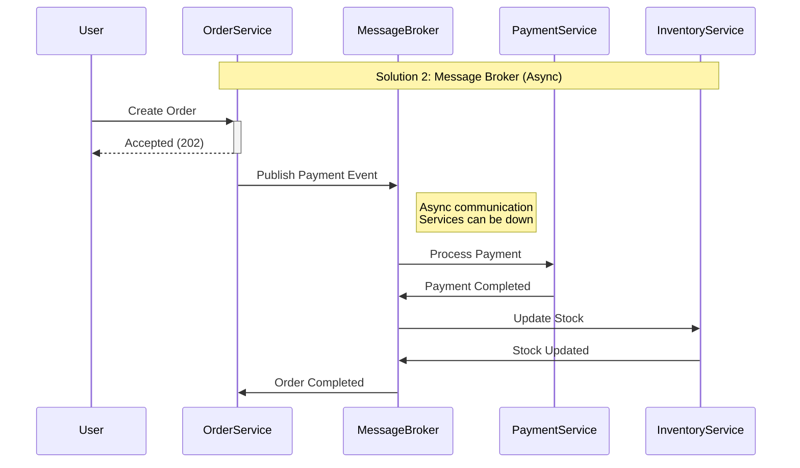

```mermaid
sequenceDiagram
    participant User
    participant OrderService
    participant MessageBroker
    participant PaymentService
    participant InventoryService
    
    Note over OrderService,InventoryService: Solution 2: Message Broker (Async)
    
    User->>+OrderService: Create Order
    OrderService-->>-User: Accepted (202)
    
    OrderService->>MessageBroker: Publish Payment Event
    Note right of MessageBroker: Async communication<br/>Services can be down
    
    MessageBroker->>PaymentService: Process Payment
    PaymentService->>MessageBroker: Payment Completed
    
    MessageBroker->>InventoryService: Update Stock
    InventoryService->>MessageBroker: Stock Updated
    
    MessageBroker->>OrderService: Order Completed
```

