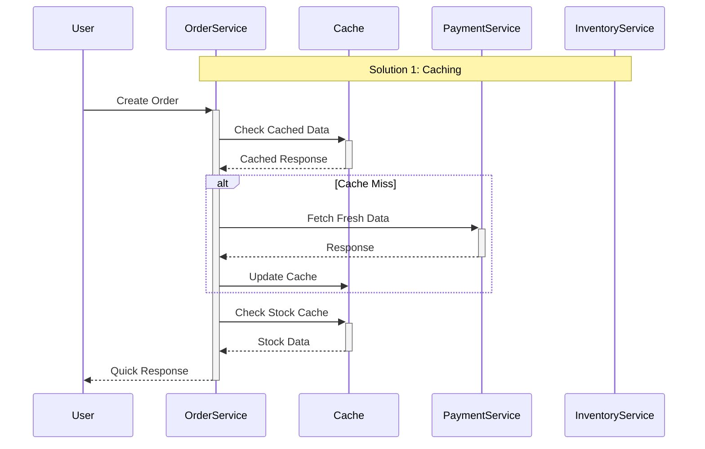

```mermaid
sequenceDiagram
    participant User
    participant OrderService
    participant Cache
    participant PaymentService
    participant InventoryService
    
    Note over OrderService,InventoryService: Solution 1: Caching
    
    User->>+OrderService: Create Order
    
    OrderService->>+Cache: Check Cached Data
    Cache-->>-OrderService: Cached Response
    
    alt Cache Miss
        OrderService->>+PaymentService: Fetch Fresh Data
        PaymentService-->>-OrderService: Response
        OrderService->>Cache: Update Cache
    end
    
    OrderService->>+Cache: Check Stock Cache
    Cache-->>-OrderService: Stock Data
    
    OrderService-->>-User: Quick Response
```