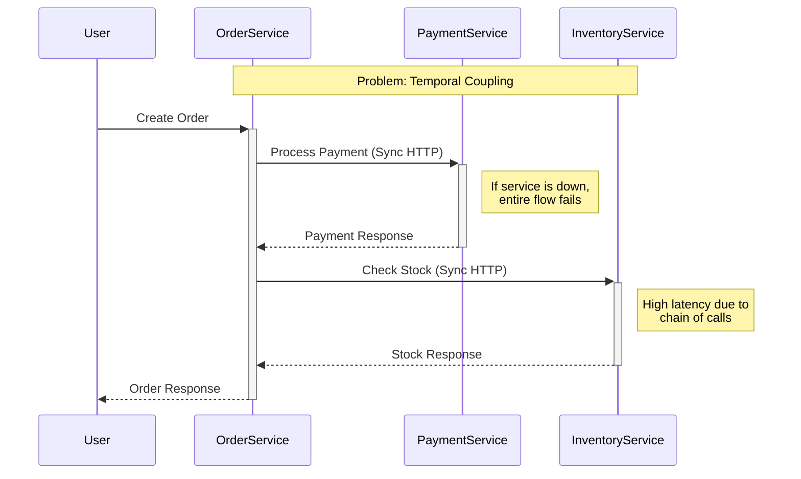

# Solution strategies
1. Caching [01-temporal-coupling-solution-cache.md](01-temporal-coupling-solution-cache.md)
2. Broker [01-temporal-coupling-solution-broker.md](01-temporal-coupling-solution-broker.md)

