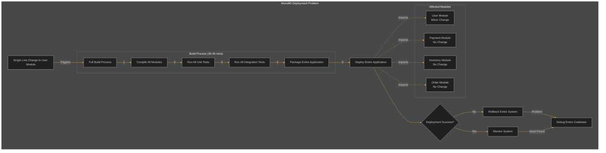

[02-deployment-coupling-solution-feature-flag.md](02-deployment-coupling-solution-feature-flag.md) \
[02-deployment-coupling-solution-modular-monolith.md](02-deployment-coupling-solution-modular-monolith.md)