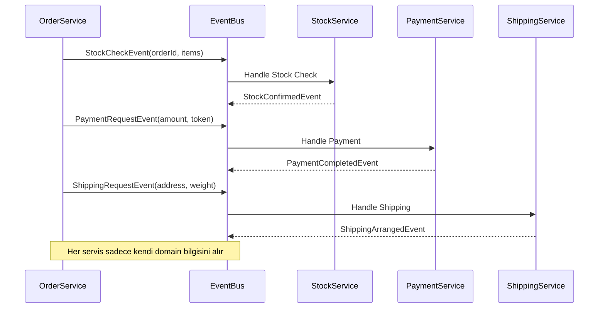

```java
// Problem durumu
public class Order {
    private Customer customer; // Tüm müşteri bilgileri
    private PaymentInfo paymentInfo; // Hassas ödeme bilgileri
    private List<CartItem> items; // Sepet detayları

    // Stok kontrolü için fazla detay içeriyor
    public void checkStock() {
        stockService.check(this); // Tüm order objesi gönderiliyor
    }
}


// Çözüm 2: Event kullanımı
public class StockCheckEvent {
    private final Long orderId;
    private final List<StockItem> items;
    // Hassas bilgiler yok
}

@Service
public class StockService {
    @EventListener
    public void onStockCheck(StockCheckEvent event) {
        // Sadece stok için gereken bilgilerle çalışır
        checkAndUpdateStock(event.getItems());
    }
}
```