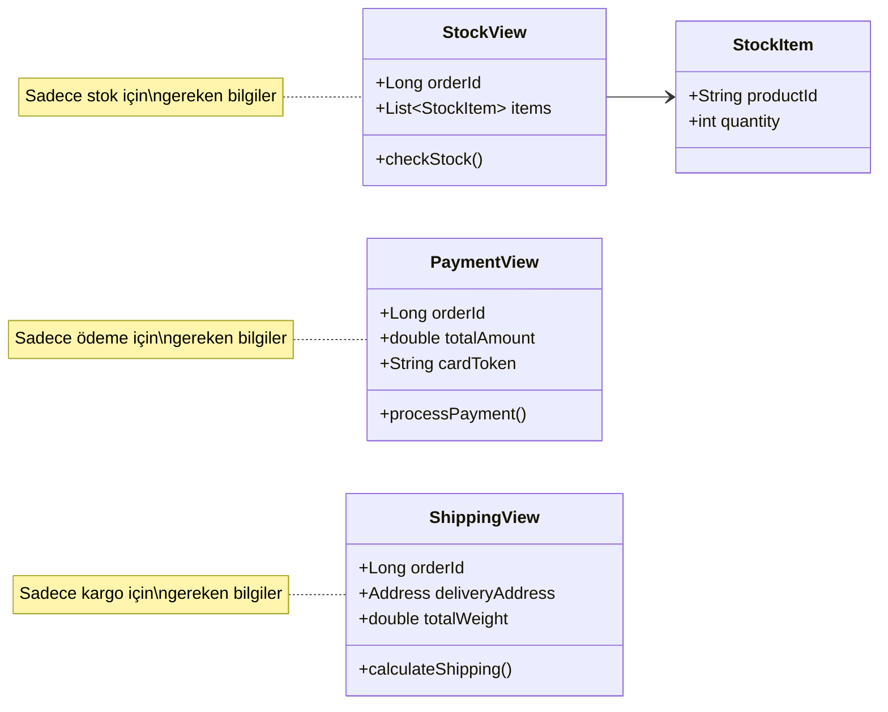

```java
// Problem durumu
public class Order {
    private Customer customer; // Tüm müşteri bilgileri
    private PaymentInfo paymentInfo; // Hassas ödeme bilgileri
    private List<CartItem> items; // Sepet detayları

    // Stok kontrolü için fazla detay içeriyor
    public void checkStock() {
        stockService.check(this); // Tüm order objesi gönderiliyor
    }
}

// Çözüm 1: View kullanımı
public class StockView {
    private final Long orderId;
    private final List<StockItem> items;  // Sadece ürün ID ve adet

    public boolean checkStock() {
        // Minimum bilgi ile stok kontrolü
        return stockService.check(items);
    }
}
```