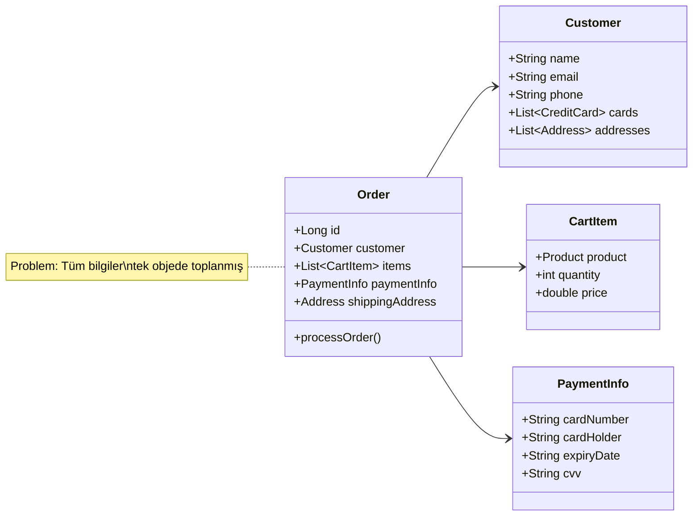

[03-domain-coupling-solution-views.md](03-domain-coupling-solution-views.md) \
[03-domain-coupling-solution-events.md](03-domain-coupling-solution-events.md)

# Başka çözüm yolları

1. Interface segregation
   1. Daha az bağımlılık 
   2. Daha kolay test
   3. Daha iyi encapsulation
   
```java
// Instead of one large interface
public interface OrderService {
    void createOrder(Order order);
    void processPayment(Order order);
    void checkStock(Order order);
    void arrangeShipping(Order order);
}

// Separate interfaces for each concern
public interface StockChecker {
    boolean checkStock(List<StockItem> items);
}

public interface PaymentProcessor {
    PaymentResult process(PaymentDetails payment);
}

public interface ShippingCalculator {
    ShippingInfo calculate(Address address, double weight);
}
```

2. Domain model patterns:
    1. İş mantığı kapsülleme
    2. Daha iyi validasyon
    3. Daha zengin domain model
```java
// Value Objects
@Value
public class Money {
    Currency currency;
    BigDecimal amount;
}

// Rich Domain Model
public class Order {
    private OrderStatus status;
    private List<OrderLine> lines;
    
    public void addProduct(Product product, int quantity) {
        validateState();
        validateInventory(product, quantity);
        lines.add(new OrderLine(product, quantity));
    }
    
    private void validateState() {
        if (status != OrderStatus.DRAFT) {
            throw new IllegalStateException("Order is not in DRAFT state");
        }
    }
}
```